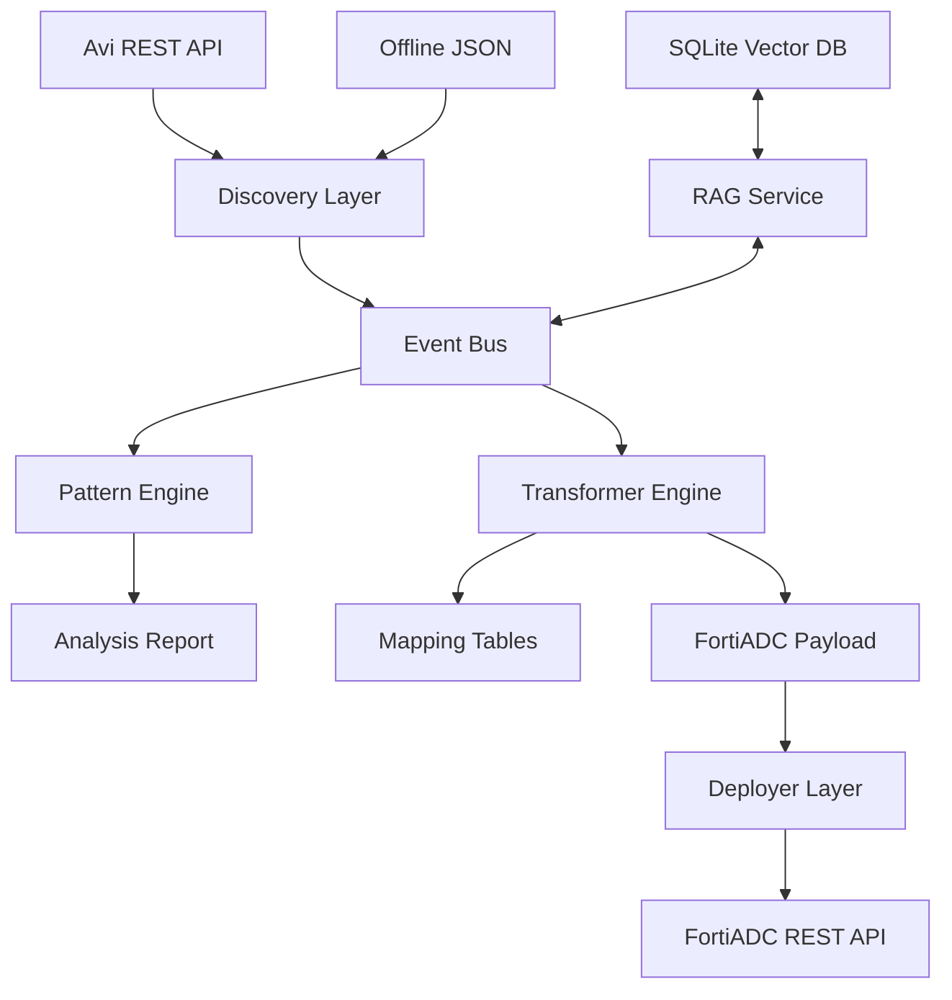

# Avi → FortiADC Migration Tool — Architecture

This document outlines the technical architecture, data model, and integration patterns of the migration framework.

---

## 1. System Overview

The framework is a modular, event-driven pipeline that treats migration as a "translation of state" rather than a simple script.

---

## 2. Core Components

### 2.1 The Event Bus (`core/events.py`)
Central nervous system that captures every operation, warning, and discovery result. It handles sanitization (masking IPs/secrets) before logging.

### 2.2 Intelligence Engine (`core/intelligence.py`)
Uses deterministic heuristics to detect "Risk Patterns":
- **P01 DataScript Concentration**: Identifying Lua logic that requires manual rewrite.
- **P02 Certificate Cascades**: Tracking non-exportable private keys.
- **P07 GSLB Out-of-Scope**: Detecting configurations that exceed the tool's automation.

### 2.3 Knowledge Base (RAG)
Stored in `state/rag_index.db`, this uses:
- **TF-IDF Sparse Vectors**: For lexical matching of CLI flags and object names.
- **BM25 Reranking**: For high-precision relevancy scoring.
- **MMR (Maximal Marginal Relevance)**: For diverse search results.

---

## 3. Data Model

The framework operates on three primary models:

1. **Discovery Model**: A standardized schema representing Avi configuration.
2. **Analysis Model**: A mapping of Avi objects to their FortiADC compatibility status (AUTO/WARN/MANUAL/BLOCKED).
3. **Target Model**: Valid FortiADC API payloads, ordered by dependency.

---

## 4. State & Governance

State is maintained in per-environment JSON ledgers (`state/<env>-ledger.json`). 

- **Idempotency**: Completed phases are skipped in subsequent runs.
- **Audit Chain**: Every log entry includes a SHA-256 hash of the previous line, ensuring log integrity.
- **Governance Gate**: Live deployment (`--execute`) is blocked until a Change Request ID is recorded in the ledger.

---

## 5. Security Architecture

- **Credential Isolation**: Credentials are only read from `config.yaml` or Environment Variables; they never enter reports or log files.
- **Air-Gap Compliance**: No external calls are made during transformation or analysis.
- **Input Sanitization**: All user-provided filenames and environment names are canonicalized to prevent path traversal.
